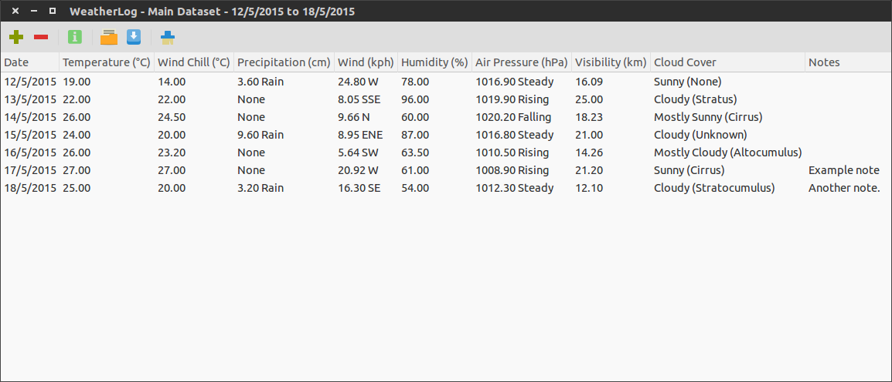

# About WeatherLog

WeatherLog is an application for keeping track of the weather and getting information about past trends.

WeatherLog can organize weather data and present it in a clear, easy to understand manner. It can also show detailed information about
patterns and overall info, as well as display graphs to visualize the data.

# Using WeatherLog

WeatherLog requires the Python interpreter to run. Development is done using 2.7.x, but it should work with 3.x as well. GTK+ 3 and its Python bindings
are also required. [Matplotlib](http://matplotlib.org/) must be installed to use the graph features, though the rest of the application will function normally if this dependency
is missing.

To run WeatherLog, open a terminal in the directory containing the files and type `python weatherlog.py`. On some systems double-clicking on the 
`weatherlog.py` file will also work.

WeatherLog currently only runs on Linux and Windows. Note that while the application should work on Windows, it has not been extensively tested on that
platform.

# License

WeatherLog is released under the [GNU General Public License version 3](https://www.gnu.org/licenses/gpl-3.0.txt). See the `LICENSE.md` file for more information.

WeatherLog uses the [OpenWeatherMap](http://openweathermap.org/) service to get current weather conditions and forecasts. Please see their [terms of service](http://openweathermap.org/terms)
before using these features.

WeatherLog uses [weatherlog-openweathermap](https://github.com/achesak/weatherlog-openweathermap) to get weather data from OpenWeatherMap. This library is released
under the [MIT open source license](http://opensource.org/licenses/mit-license.php).

Icons:
* Weather icons from a set by [Mr J](https://www.iconfinder.com/iconsets/weather-icons-8).
* Error icon from a [set](https://www.iconfinder.com/iconsets/freecns-cumulus) by [Yannik Lung](http://yanlu.de/).
